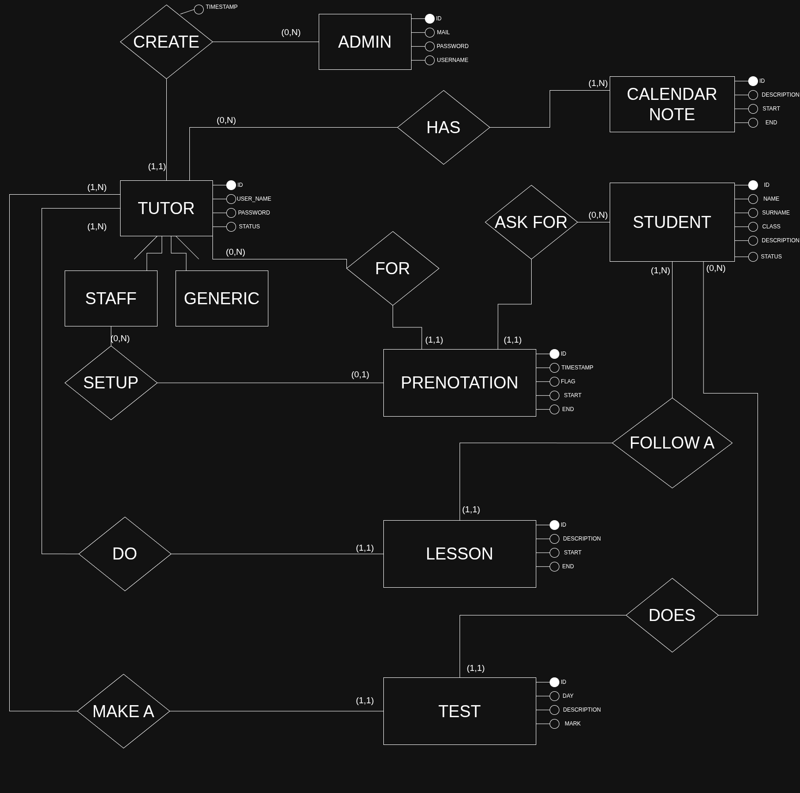

# Tutorly - Tutoring Management System

**Tutorly** is a complete platform for managing tutoring and academic support activities. The system allows you to organize lessons, manage students, track bookings, and generate detailed reports on educational activities.

---

**Document**: 00_Project_Overview.md  
**Last Updated**: July 8, 2026  
**Version**: 1.0.0  
**Author**: Tutorly Development Team  

---

## 📋 Table of Contents

- [Project Overview](#project-overview)
- [System Architecture](#system-architecture)
- [Main Components](#main-components)
- [Main Features](#main-features)
- [Technology Stack](#technology-stack)
- [Getting Started](#getting-started)
- [Project Structure](#project-structure)
- [Complete Documentation](#complete-documentation)
- [Security](#security)
- [Testing](#testing)
- [Troubleshooting](#troubleshooting)
- [Contributing](#contributing)
- [Roadmap](#roadmap)
- [License](#license)
- [Team](#team)
- [Contacts](#contacts)

---

## Project Overview

Tutorly is a full-stack web application designed to simplify tutoring activity management. The system offers an intuitive interface for tutors and administrators, allowing you to:

- **Manage lessons**: Create, edit, and delete lessons with specific students
- **Organize students**: Complete registry with information on classes and subjects
- **Track bookings**: Lesson booking system with confirmation
- **Plan activities**: Integrated calendar with notes and reminders
- **Generate reports**: Excel export of lessons, monthly statistics, and student reports
- **Control access**: Dual authentication system (tutors and administrators) with differentiated roles

The system is designed for tutoring centers, private teachers, or educational organizations that need a complete tool to manage their activities.

---

## System Architecture

Tutorly follows a **three-tier** architecture with separation between user interface, application logic, and data persistence:

```
┌─────────────────────────────────────────────────────────────────┐
│                         CLIENT LAYER                            │
│                    (Browser - User Interface)                   │
│                                                                 │
│  Technologies: HTML5, CSS3, JavaScript (Vanilla), EJS Templates │
└────────────────────────┬────────────────────────────────────────┘
                         │ HTTP/HTTPS
                         ▼
┌─────────────────────────────────────────────────────────────────┐
│                    PRESENTATION LAYER                           │
│                   Node.js Express Frontend                      │
│                 (Port 3000 HTTP / 3443 HTTPS)                   │
│                                                                 │
│  • Session-based authentication                                 │
│  • EJS page rendering                                           │
│  • Middleware management (auth, logging)                        │
│  • Static files (CSS, JavaScript, images)                       │
│  • Excel report generation                                      │
│  • SSL/TLS support (self-signed certificates for dev)           │
└────────────────────────┬────────────────────────────────────────┘
                         │ HTTPS + API Key
                         ▼
┌─────────────────────────────────────────────────────────────────┐
│                     BUSINESS LOGIC LAYER                        │
│                   Java Spring Boot Backend                      │
│                         (Port 8443)                             │
│                                                                 │
│  • REST API (50+ endpoints)                                     │
│  • Business logic validation                                    │
│  • JPA/Hibernate ORM                                            │
│  • API Key authentication                                       │
│  • SSL/TLS encryption                                           │
└────────────────────────┬────────────────────────────────────────┘
                         │ JDBC
                         ▼
┌─────────────────────────────────────────────────────────────────┐
│                       DATA LAYER                                │
│                    PostgreSQL Database                          │
│                                                                 │
│  • Relational tables (tutors, students, lessons, etc.)          │
│  • Foreign keys and constraints                                 │
│  • Performance indexes                                          │
│  • Automatic backup                                             │
└─────────────────────────────────────────────────────────────────┘
```

### Communication Flow

1. User interacts with web interface (browser)
2. Node.js frontend handles sessions and page rendering
3. Data requests are forwarded to Java backend via HTTPS
4. Backend processes business logic and queries the database
5. Data returns through the same layers back to the user

---

## Main Components

### 1. **Backend API (Java Spring Boot)**

The heart of the system is a robust RESTful API built with Spring Boot 3.4.1 and Java 21.

**Main features**:
- ✅ **50+ REST endpoints** for all CRUD operations
- ✅ **3-layer architecture**: Controller → Service → Repository
- ✅ **JPA/Hibernate** for ORM (Object-Relational Mapping)
- ✅ **API Key Security** for API authentication
- ✅ **SSL/TLS** for secure communications (HTTPS)
- ✅ **Data validation** with Bean Validation
- ✅ **Centralized error handling** with @ControllerAdvice

**Managed entities**:
- `Tutor`: Teachers/tutors with roles (STAFF, GENERIC)
- `Student`: Students with class and information
- `Lesson`: Lessons with tutor, student, schedules
- `Prenotation`: Lesson bookings (confirmed/unconfirmed)
- `Test`: Student assessments and exam results
- `CalendarNote`: Notes and reminders for the calendar
- `Admin`: System administrators

**Technologies**:
- Java 21
- Spring Boot 3.4.1
- Spring Data JPA
- Hibernate
- PostgreSQL Driver
- Maven

📚 **Detailed documentation**: [01_Java_Backend_API.md](01_Java_Backend_API.md)

---

### 2. **Frontend Server (Node.js Express)**

User-friendly web interface that handles authentication, sessions and presents data to users.

**Main features**:
- ✅ **Dual authentication**: Separate system for tutors and administrators
- ✅ **Session management** with express-session
- ✅ **Password hashing** with bcrypt (10 salt rounds)
- ✅ **Role-based access control** (RBAC)
- ✅ **Server-side rendering** with EJS templates
- ✅ **Progressive Web App (PWA)**: Offline fallback support and caching via service workers (`manifest.json`, `service-worker.js`).
- ✅ **Excel export** for reports and statistics
- ✅ **Advanced logging** with colors and timestamps
- ✅ **Middleware chain** for authentication and authorization
- ✅ **HTTPS support** with self-signed certificates for local development

**Main pages**:
- **Login/Admin Login**: Dual authentication for tutors and admins
- **Home**: Dashboard with daily lessons and tasks
- **Lessons**: Complete lesson management (CRUD)
- **Calendar**: Interactive calendar with notes
- **Admin Panel**: Tutor and student management (admin only)
- **Staff Panel**: Advanced features for STAFF role

**Technologies**:
- Node.js 18+
- Express.js 4.18.2
- EJS 3.1.10
- bcrypt 6.0.0
- express-session 1.18.2
- ExcelJS 4.4.0
- Native HTTPS module for SSL/TLS

📚 **Detailed documentation**: [03_Nodejs_Frontend.md](03_Nodejs_Frontend.md)
📚 **HTTPS Setup Guide**: [04_HTTPS_Setup_Guide.md](04_HTTPS_Setup_Guide.md)

---

### 3. **Database (PostgreSQL)**

PostgreSQL relational database for data persistence.

**Entity Relationship Model**:



**Features**:
- Foreign key relationships between tables
- Indexes for query optimization
- Constraints for data integrity
- Timezone support for dates/times
- Auto-increment for IDs

📚 **Complete database documentation**: [07_Database_Configuration.md](07_Database_Configuration.md)

---

## Main Features

### For Tutors

#### 🏠 Home Dashboard
- View today's lessons
- Tasks and notes from calendar
- Pending bookings
- Quick actions for common operations
- Mini calendar with month navigation and event-indicator dots on days with scheduled lessons, prenotations, or tasks

#### 📚 Lesson Management
- **Create lesson**: Select student, set times, add description
- **Edit lesson**: Update times, student or details
- **Delete lesson**: Cancel lessons no longer needed
- **Filter lessons**: By date, student, tutor
- **List view**: Complete table with all information, including each lesson's ID
- **Monthly statistics**: Total and per-class (M/S/U) hours, with overlapping (concomitant) lessons counted once and cross-class overlaps credited to the higher-priority class

#### 👨‍🎓 Student Management
- Student registry with name, email, phone
- Class information (U, M, S)
- Lesson history per student
- Quick student search

#### 📅 Calendar
- Monthly calendar view
- Display of scheduled lessons
- Daily notes and reminders
- Month navigation
- Color-coding by event type

#### 📊 Excel Reports
- **Monthly lesson report**: All lessons of the month
- **Student report**: Lessons specific to each student
- **Tutor report**: Annual statistics per tutor (own account only)

#### 📝 Bookings
- View received bookings
- Confirm or reject bookings
- Create new bookings for students
- **Prenotation → Lesson automation**: Click a booked prenotation (from the Home dashboard or My Lessons) to open the Add Lesson form pre-filled with its student, date, and time; confirming creates the lesson and automatically deletes the source prenotation

#### 📊 Complete Reports (Only for STAFF tutor)
- Access to all reports from all tutors
- Global center statistics
- Custom exports

---

### For Administrators

#### 👥 Tutor Management
- **View all tutors**: Complete list with status
- **Create new tutor**: Add tutors with credentials
- **Block/Unblock account**: Account status management (ACTIVE/BLOCKED)
- **Delete tutor**: Permanent removal (with confirmation)
- **Assign roles**: STAFF (advanced) or GENERIC (basic)

#### 👨‍🎓 Student Management (Admin)
- Full access to all students
- Edit and delete without restrictions

#### 🔐 Security
- Separate login with admin credentials
- Log of all admin login attempts
- Passwords hashed with bcrypt
- Configurable session timeout

---

### For STAFF Role

Tutors with **STAFF** role have additional features:

- **Staff Panel**: Dedicated panel with advanced functions
- **Calendar note management**: Create notes visible to all
- **Calendar tutor filter**: Filter the calendar view to show only a selected tutor's prenotations (notes remain always visible)
- **Extended reports**: Access to reports from other tutors (if authorized)
- **Advanced configurations**: System settings

---

## Technology Stack

### Backend
| Technology        | Version  | Usage                           |
|-------------------|----------|---------------------------------|
| Java              | 21       | Main language                   |
| Spring Boot       | 3.4.1    | Application framework           |
| Spring Data JPA   | 3.4.1    | ORM and repositories            |
| Hibernate         | 6.4+     | Object-Relational Mapping       |
| PostgreSQL Driver | Latest   | Database connection             |
| Maven             | 3.8+     | Build and dependency management |

### Frontend
| Technology      | Version  | Usage              |
|-----------------|----------|--------------------|
| Node.js         | 18+      | JavaScript runtime |
| Express.js      | 4.18.2   | Web framework      |
| EJS             | 3.1.10   | Template engine    |
| bcrypt          | 6.0.0    | Password hashing   |
| express-session | 1.18.2   | Session management |
| ExcelJS         | 4.4.0    | Excel generation   |
| HTTPS Module    | Native   | SSL/TLS support    |

### Database
| Technology | Version  | Usage               |
|------------|----------|---------------------|
| PostgreSQL | 12+      | Relational database |

### Security
- **HTTPS/SSL**: Encrypted communication on both layers
  - Backend: Java Spring Boot with SSL (port 8443)
  - Frontend: Node.js with optional HTTPS (port 3443)
- **Self-Signed Certificates**: For local development (script included)
- **API Key**: API request authentication between frontend and backend
- **bcrypt**: Password hashing (10 rounds)
- **Session-based auth**: httpOnly and secure cookies
- **Role-based access (RBAC)**: Authorization control with roles

---

## Getting Started

### Prerequisites

1. **Java 21** or higher ([Download](https://www.oracle.com/java/technologies/downloads/))
2. **Node.js 18+** and npm ([Download](https://nodejs.org/))
3. **PostgreSQL 12+** installed and running ([Download](https://www.postgresql.org/download/))
4. **Maven 3.8+** (included via Maven Wrapper)
5. **Git** to clone the repository

---

### Quick Installation

#### 1. Clone the Repository

```bash
git clone <repository-url>
cd Tutorly
```

#### 2. Configure the Database

```bash
# Access PostgreSQL
psql -U postgres

# Create the database
CREATE DATABASE tutorly_db;

# Exit
\q
```

#### 3. Configure Java Backend

```bash
cd Java/backend-api
```

📚 **For detailed backend configuration** (application.properties, database credentials, SSL setup):  
See [01_Java_Backend_API.md - Application Properties Configuration](01_Java_Backend_API.md#3-application-properties-configuration)

#### 4. Start Java Backend
**OPTION A: VIA BASH WITH MAVEN WRAPPER**

LINUX/MAC:
```bash
cd path/to/Tutorly/Java/backend-api
./mvnw spring-boot:run
 ```       
WINDOWS:
```bash
cd C:\path\to\Tutorly\Java\backend-api
mvnw.cmd spring-boot:run
```
**OPTION B: VIA BASH WITH MAVEN WRAPPER AND EXPLICIT JAVA_HOME**

LINUX/MAC:
```bash
export JAVA_HOME=/usr/lib/jvm/java-21-openjdk
./mvnw spring-boot:run
```     
WINDOWS:
```bash
set JAVA_HOME=C:\Program Files\Java\jdk-21
mvnw.cmd spring-boot:run
```
**OPTION C: VIA BASH WITH MAVEN INSTALLED GLOBALLY**

ON EVERY SYSTEM:
```bash
cd /home/skenny/Documents/GitHub/Tutorly/Java/backend-api
mvn spring-boot:run
```  
**OPTION D: BUILD JAR and EXECUTE**

ON EVERY SYSTEM:
```bash
./mvnw clean package
java -jar target/backend-api-0.0.1-SNAPSHOT.jar
```

**OPTION E: EXECUTE SERVER WITH GUI:**

LINUX/MAC:
```bash
cd /path/to/Tutorly/Java/backend-api
./run-gui.sh
```
WINDOWS:
```bash
cd C:\path\to\Tutorly\Java\backend-api
run-gui.bat
```


Backend will be available at: `https://localhost:8443`

📚 **GUI Documentation**: [02_Java_GUI_Launcher.md](02_Java_GUI_Launcher.md)

#### 5. Configure Node.js Frontend

```bash
cd ../../Nodejs

# Install dependencies
npm install

# Copy the example environment file and fill in your values
cp .env.example .env
```

Runtime configuration (Java backend host/port, API key, session secrets, `PORT`) is loaded from `Nodejs/.env` via `dotenv` - see `server_utilities/config.js` for the full list of variables and their defaults. `.env` is git-ignored; use `.env.example` as the template for onboarding.

#### 6. Start Node.js Frontend

**Option A: HTTP Mode (development default)**
```bash
# Standard Development (with auto-reload)
npm run dev

# Production
npm start
```

Frontend will be available at: `http://localhost:3000`

**Option B: HTTPS Mode (with self-signed certificates)**
```bash
# Generate SSL certificates (first time only)
npm run generate-cert

# Development with HTTPS and auto-reload
npm run dev:https

# Production with HTTPS
npm run https
```

Frontend will be available at:
- **HTTPS**: `https://localhost:3443` (self-signed certificate)
- **HTTP**: `http://localhost:3000` (redirects to HTTPS)

⚠️ **Note**: Browser will show security warning for self-signed certificates. Click "Advanced" → "Proceed to localhost" to continue.

📚 **For detailed HTTPS setup**: See [04_HTTPS_Setup_Guide.md](04_HTTPS_Setup_Guide.md)

#### 7. Access the System

Open browser and go to: `http://localhost:3000`

**Tutor Login**: `http://localhost:3000/login`
- Username/password: (create users via admin panel)

**Admin Login**: `http://localhost:3000/adminLogin`
- Username/password: (configure in database or via API)

---

## Project Structure

```
Tutorly/
│
├── Java/                           # Backend API
│   └── backend-api/
│       ├── src/
│       │   └── main/
│       │       ├── java/com/tutorly/app/backend_api/
│       │       │   ├── controller/     # REST Controllers
│       │       │   ├── service/        # Business Logic
│       │       │   ├── repository/     # Data Access Layer
│       │       │   ├── entity/         # JPA Entities
│       │       │   ├── dto/            # Data Transfer Objects
│       │       │   ├── config/         # Configuration
│       │       │   └── gui/            # GUI Launcher
│       │       └── resources/
│       │           └── application.properties
│       ├── pom.xml                 # Maven dependencies
│       └── run-gui.sh/bat          # GUI launcher scripts
│
├── Nodejs/                         # Frontend Server
│   ├── src/
│   │   └── index.js                # Main Express server
│   ├── server_utilities/           # Service modules
│   │   ├── authService.js          # Authentication
│   │   ├── authMiddleware.js       # Middleware
│   │   ├── javaApiService.js       # API client
│   │   ├── passwordService.js      # Password hashing
│   │   ├── userService.js          # User operations
│   │   ├── logger.js               # Logging
│   │   ├── adminLogger.js          # Admin logging
│   │   ├── excel.js                # Excel reports
│   │   └── config.js               # Configuration
│   ├── views/                      # EJS templates
│   │   ├── login.ejs
│   │   ├── adminLogin.ejs
│   │   ├── home.ejs
│   │   ├── lessons.ejs
│   │   ├── calendar.ejs
│   │   ├── admin.ejs
│   │   └── staffPanel.ejs
│   ├── public/                     # Static files
│   │   ├── css/                    # Stylesheets
│   │   └── js/                     # Client JavaScript
│   ├── migrations/                 # DB migrations
│   └── package.json                # npm dependencies
│
├── Database/                       # Database scripts
│   └── POSTGRE_DB_CONFIG.TXT
│
└── docs/                           # Centralized documentation
    ├── 00_Project_Overview.md      # This file
    └── ...                         # Other doc files
```

---

## Complete Documentation

Each component has its own detailed documentation:

| Component | Documentation | Description |
|------------|---------------|-------------|
| **Java Backend API** | [01_Java_Backend_API.md](01_Java_Backend_API.md) | Architecture, API endpoints, configuration |
| **Java GUI** | [02_Java_GUI_Launcher.md](02_Java_GUI_Launcher.md) | Graphical interface for server management |
| **Node.js Frontend** | [03_Nodejs_Frontend.md](03_Nodejs_Frontend.md) | Architecture, routes, authentication, middleware |
| **HTTPS Setup** | [04_HTTPS_Setup_Guide.md](04_HTTPS_Setup_Guide.md) | SSL/TLS configuration for local development |
| **Service Modules** | [05_Service_Modules.md](05_Service_Modules.md) | Node.js utility modules documentation |
| **Database Migrations** | [06_Database_Migrations.md](06_Database_Migrations.md) | Password hashing and data migration scripts |
| **Database Configuration** | [07_Database_Configuration.md](07_Database_Configuration.md) | PostgreSQL setup, schema, and ER model |
| **PWA Guide** | [12_PWA_Guide.md](12_PWA_Guide.md) | Documentation on Progressive Web App implementation |

---

## Security

### Authentication
- **Password hashing**: Bcrypt with 10 salt rounds
- **Session-based**: httpOnly cookies to prevent XSS
- **Dual authentication**: Separate systems for tutors and admins
- **API Key**: Backend request authentication

### Authorization
- **Role-Based Access Control (RBAC)**: ADMIN, STAFF, GENERIC roles
- **Middleware protection**: Routes protected with middleware
- **Account blocking**: Ability to block compromised accounts

### Communication
- **HTTPS/SSL**: Encrypted communication between frontend and backend
  - **Backend (Java)**: Always HTTPS on port 8443
  - **Frontend (Node.js)**: Optional HTTPS on port 3443 (HTTP on port 3000)
- **API Key header**: X-API-Key for every API request
- **Self-Signed Certificates**: Supported for local development
  - Automatic generation script included (`npm run generate-cert`)
  - Valid for 365 days
  - Browser security warnings expected (click "Advanced" → "Proceed")
  - **Not for production use** - use trusted CA certificates in production

### Best Practices
- ✅ Never store passwords in plain text
- ✅ Configurable session timeout
- ✅ Logging of all login attempts
- ✅ Input validation on client and server
- ✅ Data sanitization before database operations

---

## Testing

### Backend Testing

```bash
cd Java/backend-api

# Run all tests
./mvnw test

# Run specific test class
./mvnw test -Dtest=LessonServiceTest

# Run with coverage
./mvnw test jacoco:report
```

### Frontend Testing (WIP)

```bash
cd Nodejs

# Note: Tests are a Work In Progress.
# You can add a testing framework (example: Jest):
npm install --save-dev jest

# Currently npm test will exit with an error.
```

---

## Troubleshooting

### Port Already in Use

**Symptom**: `Error: Port XXXX already in use` (8443, 3000, 3443, etc.)

**Solution**:
```bash
# Linux/Mac
lsof -ti:PORT | xargs kill -9
# Example: lsof -ti:8443 | xargs kill -9

# Windows
netstat -ano | findstr :PORT
taskkill /PID <PID> /F
```

---

### Frontend Can't Connect to Backend

**Symptom**: `Error: connect ECONNREFUSED`

**Solution**:
1. Verify backend is running on port 8443
2. Check `server_utilities/config.js`:
   - `JAVA_API_URL` must be `https://localhost:8443`
   - `JAVA_API_KEY` must match the backend

---

### Database Connection Error

**Symptom**: `Connection refused` or `Authentication failed`

**Solution**:
1. Verify PostgreSQL is running:
   ```bash
   sudo systemctl status postgresql  # Linux
   pg_ctl status                      # Mac/Windows
   ```

2. Check credentials in `application.properties`:
   ```properties
   spring.datasource.url=jdbc:postgresql://localhost:5432/tutorly_db
   spring.datasource.username=postgres
   spring.datasource.password=<your_password>
   ```

3. Manual connection test:
   ```bash
   psql -h localhost -U postgres -d tutorly_db
   ```

---

### Sessions Don't Persist

**Symptom**: User gets logged out on every page refresh, browser restart, or server restart

**Solution**:
- Tutor sessions are already backed by a persistent file store (`server_utilities/fileSessionStore.js`, data in `Nodejs/data/session-store.json`) with a 30-day duration when "Remember me" is checked, so they survive server restarts - verify that file is writable and not being wiped between deploys
- Verify `.env`: `TUTOR_SESSION_SECRET` must be set
- Check cookie settings match HTTP/HTTPS mode (secure flag)
- For multi-instance/horizontal scaling in production, move to a shared session store (e.g. Redis) instead of the file-based store, since the latter is local to a single instance
- Check that cookies are enabled in the browser

---

### SSL Certificate Errors

**Symptom**: `SSL handshake failed` or `unable to find valid certification path`

**Solution**:
- **Development**: Use `-k` flag with curl for testing: `curl -k https://...`
- **Self-signed certs**: Browser will show warnings - click "Advanced" → "Proceed"
- **Java backend**: Verify `keystore.p12` is in `src/main/resources/`
- **Node.js frontend**: Regenerate certificates: `npm run generate-cert`
- **Production**: Use CA-signed certificates (Let's Encrypt, etc.)

---

### API Authentication Failures

**Symptom**: `401 Unauthorized` or API key errors

**Solution**:
1. Verify API keys match between frontend and backend
2. Check `X-API-Key` header is being sent with requests
3. Frontend: `JAVA_API_KEY` in `config.js`
4. Backend: `api.security.keys` in `application.properties`

---

> **📚 For component-specific troubleshooting**, see:
> - [Backend Issues](01_Java_Backend_API.md#troubleshooting)
> - [Frontend Issues](03_Nodejs_Frontend.md#troubleshooting)
> - [HTTPS Issues](04_HTTPS_Setup_Guide.md#troubleshooting)

---

## Contributing

Contributions, issues and feature requests are welcome!

### How to contribute:

1. **Open an Issue**
2. **Fork the project**
3. **Create a feature branch** (`git checkout -b feature/AmazingFeature`)
4. **Commit your changes** (`git commit -m 'Add some AmazingFeature'`)
5. **Push to the branch** (`git push origin feature/AmazingFeature`)
6. **Open a Pull Request**

### Code Style

- **Java**: Follow standard Java conventions (Google Java Style)
- **JavaScript**: Use ESLint (config included)
- **Commits**: Use conventional commits (`feat:`, `fix:`, `docs:`, etc.)

### Contributors

We thank the following users for their fundamental contribution
- Gorlix (Alessandro Gorla) -> for PWA support implementation

---

## Roadmap

### Sub-Version 1.1 (Next Release)
- [x] Automation to add a lesson from a prenotation
- [x] Filter by tutor in calendar
- [ ] Edit a Lesson


### Version 2.0
- [ ] Student evaluation system


---

## License

This project is licensed under the MIT License - see the LICENSE file for details.


---

## Team

Developed by Matteo Schintu (Skenny)

---

## Contacts

For questions, support or feedback:

- **Email**: skenny.dev@gmail.com
- **Team**: Tutorly Development Team (Skenny)

---

## 🎓 Notes for Students/Developers

This project is an excellent example of:
- ✅ Complete **three-tier architecture**
- ✅ **REST API design** with Spring Boot
- ✅ **Frontend/Backend separation**
- ✅ **Relational database** with JPA
- ✅ **Authentication and authorization**
- ✅ **Session management**
- ✅ **Password security** (bcrypt)
- ✅ **Logging and monitoring**
- ✅ **Excel generation**
- ✅ **HTTPS/SSL configuration**


---

---

**Navigation**  
**Next**: [01_Java_Backend_API.md](01_Java_Backend_API.md) ➡️  
🏠 **Home**: [Documentation Index](README.md)
